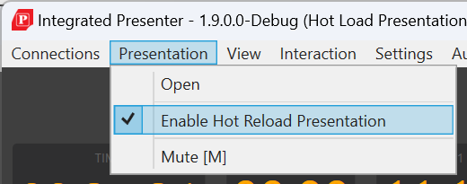
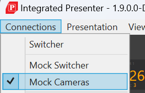
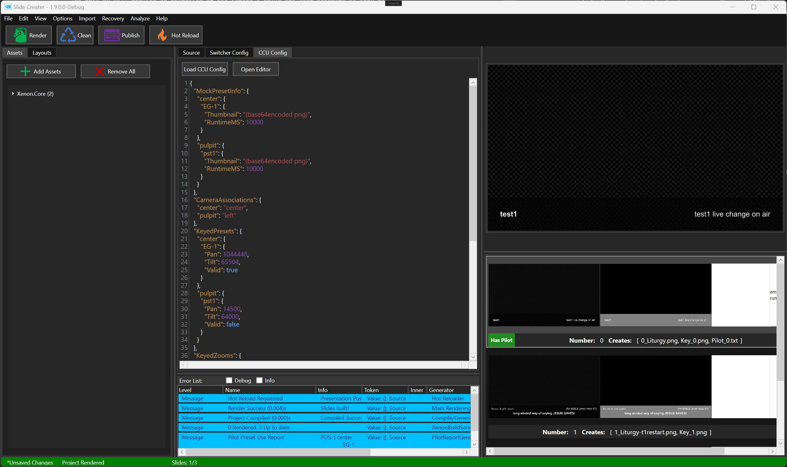
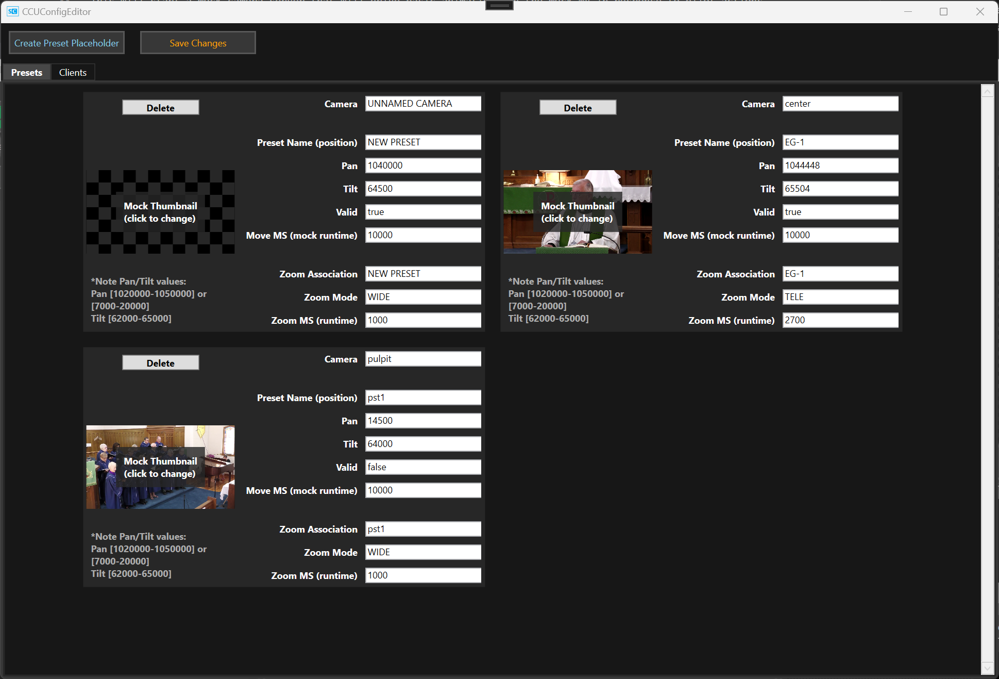
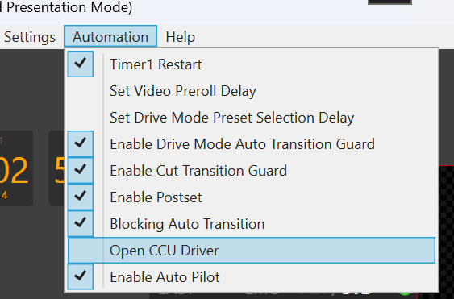

# Slide Creater / Integrated Presenter 1.9

## Slide Creater Changes

- 'Clean' button will clear the cache of previously rendered slides and force Slide Creater to draw every pixel of every slide fresh (this may be usefull if it hasn't detected a slide has changed and required re-rendering. It's pretty smart most of the time). (There's also the setting in Options>Clean Pre Render to by default do this)

- Bells file now only adds the audio file as a resource. Importing from LSB will attempt to detect where bells are and apply the appropriate script automatically- you'll just need to add the bells file using 'Add Resource'.

- Slide Creater warn/errors during compilation for malformed/invalid pilot commands, or commands that reference un-configured presets.

## Hot Reload

Integrated Presenter now includes support for hot-reloading presentations.
Slide Creater will now host a hot-reload server that can provide updated presentations to Integrated Presenter, immediabely upon rendering the project.

### Setup

To enable hot reloading:

1. Click the 'Hot Reload' button to start the hot-reload server
2. Render the project (if the project was previously rendered, it will re-publish the last rendered presentation) 

After doing so you should see:

The status bar should show that a hot-reload is available and waiting to be picked up by Integrated Presenter
Once it's accepted, the status bar should return to green and indicate a successful render.

The next step is to get it loaded into Integrated Presenter.

Check 'Enable Hot Reload Presentation'

Integrated Presenter will now be listenting for when Slide Creater publishes hot-reloads,
and will immediately reload the presentation when one is made available.

### Comments on use

When a reload occurs, Integrated Presenter will attempt to open the new presentation at the previous location.
Provided that any edits made to the presentation only effected slides ahead of where Integrated Presenter had gotten to, this will perform as expected. If new slides were added to the presentation before the old curent slide, then when the presentation is hot reloaded you will find yourself a few slides behind.
Curently Integrated Presenter will not attempt to rebuild the exact state of the switcher prior to the hot-reload.
This means that if your slide had a script (or drive automation) that modified the switcher state (eg. changed the program camera source)- and you modify the slides to have it do something different, when reloading, the switcher will remain in the same state, it won't be reset to the equivalent point prior to either version of the slide having been run.
In practice this means if you need to edit a slide that has already run, you'll be responsible for manually resetting the switcher state to the conditions you expect to fully test if the new slides works as expected.

(*NOTE: pilot actions are the exception here, they will be updated correctly to reflect the appropriate state as if all previous slides in the presentation had been run)

NOTE: I went through a test presentation on real hardware using hot reload mode, making changes during the presentation. Seemed to work just fine. So while I'd not nessecarily reccommend relying on Hot-Reload for Sunday Playout, it probably works.

## Better Mock MV

A more faithfull mock multiviewer has replaced the old one!

The UI is a bit more acurate:
- PIP's now have labels
- PIP's now respect BMDSwitcherConfig.json routing
- PIP's borders reflect on-air state
- ME effect engine can now handle fading animations for PIP
- DSK1 tie state acuratley reflected on Preview and Program
- DSK1 tie preview works correctly on Preview
- PIP's are able to load/play video sources (no more black 'Video File'!)
    - note: the PIP's aren't forcibly synced agains the true display output, so it's quite probable there was a delay loading the video, and it will be ~1sec behind the other

The new MV supports moving cameras! (well kinda)

The Reset Cameras button will reset all the PIP's images to their defaults.
Using the new Move Camera dialog you can dynamically change the PIP's source to any image you'd like.
(There is also interop with pilot presets, more on that later)

Above: Manually changing the camera image for the 'PULPIT' camera.

Now it's available for use:

## Mock Pilot

The new MV now supports mocking pilot actions. When running through a presentation with pilot actions,
if Integrated Presenter is configured to use 'Mock Cameras'

This will start a mock camera server that will drive basic animations on the mock MV in response to pilot actions.

Here you can see the pilot action firing. The pilot action was setup to have a thumbnail representing the new camera angle- in this case the choir.
The mock MV will provide an animation of the camera's drive and zoom programs as they happen.
The image will zoom-in/out as specified by the preset's exact zoom timing. Since it's not possible to determine the travel time for a physical mount to arrive at a position starting at an unknown location- the preset has been supplied with a mock runtime for the drive program. The mock MV will animate the image side-to side while this is occuring.
Note the mock MV animations concur with the pilot-UI run status, which switchers to 'running' when the animations begin, and ends with 'done' once complete.

The intention here is to provide:

- a more lifelike mock for woring with camera automation
- conspicuous UI feedback for cases where you end up moving a camera on-air (when perhaps that wasn't the intention)

### Pilot Config

The days of hand-editing .json files for CCU-Config.json are almost gone!

Slide Creater now supports a more GUI-friendly way!

The new CCU Config tab provides a read-only view of the curent config

* not quite but close enough. To fit in the .json format, the images (png's) are encoded as base64strings, but they get rather large and bog down the syntax-highlighting on the textbox. So while the project truly contains the full source, the UI doesn't display that part of it.

You can manually load a different file, or graphically edit the curent config.

Strictly speaking Integrated Presenter pilot commands accept:

`run[*camname*](*presetname*)@*speed*:*zoompreset*;`

- *camname* is the camera client
- *presetname* is the name of the preset (pan/tilt)
- *speed* is the speed to run (pan/tilt)
- *zoompreset* the name of the zoom program to run

NOTE: presets and zoom presets are independant of eachother. i.e defining two presets both with a Zoom Association of 'eg1' will result in one of the zoom preset settings being overwritten.

NOTE: the valid flag **must** be true for Integrated Presenter to load the preset

NOTE: for the pan/tilt settings...

Emperically the center/lectern camera point roughly at the front with settings within [1020000-1050000] (pan) and [64500] (tilt)
The pultip cam points to the front with [7000-20000] (pan) and [650000] (tilt)

You can edit the client configs as well:

Typically there should be the 3 cameras.
The client name should match the Camera Name used in all presets.
The 'Routed Input Association' is used by the mock MV to determine (based on the BMDSwitcherConfig) which input source corresponds to this camera so it can update the PIP's accordingly

-----------------------------------

**NOTE: the below features are also available in Integrated Presenter 1.8.0.11-Release**

I anticipate the typical workflow to involve loading one of a few curated config files- and either relying exclusively on the existing presets, or adding perhaps 1 or 2 new ones as required (eg. a new anthem preset etc.)
In this case you'd add a default pan/tilt and guess at zoom, then day of (or before) during sound check you can dial in the settings to what you want, and then update the preset via Integrated Presenter.

When connected to real cameras, Integrated Presenter provides additional preset controls:

For a camera Client:

### Update Pan/Tilt Position

The top listview shows all the recognized presets ('EG-1')
Either by clicking on the preset, or typing the name 'EG-1' into the Name field (yellow)
You can then click 'SAVE PST' (Red)
This will querry the mount for the curent position, and if a valid response is recieved, will update the position of the preset.
(Using it later in a presentation will automatially use the updated position)
The Command log status at the bottom will indicate the result of updating (success/fail)
If failed (occasionally happens) just click 'SAVE PST' again

### Update Zoom Program

Since the mount's don't directly track the zoom position, updating the zoom preset works a bit different.

1. Specify the zoom duration (green) in ms. This is the ammount of time (the camera will zoom for in the provided direction)
2. Specify both the zoom preset name and zoom preset mode in the following manner (yellow Name field)

    <*ZoomName*>;<*Mode*>

*ZoomName* name of the zoom preset ('EG-1')

*Mode* either 'TELE' or 'WIDE'

eg.

    EG-1;WIDE

with a specified duration of 500:

The camera will zoom all the way in, then zoom out (wide) for 500ms

TELE - specifies the camera should zoom in for the specified time (after first being zoomed all the way out)

WIDE - specifies the camera should zoom out for the specified time (after first being zoomed all the way in)

*NOTE: due to real time network constraints, zoom durations of < 200ms are not repeatably accurate
If you need a zoom level within the 200ms range, consider using the inverse (eg if you want zoom WIDE 150, try zoom TELE 3000 etc.)

NOTE: to perform a maximal zoom in/out the camera will zoom for 3800 ms (though it may hit its endpoints sooner)

