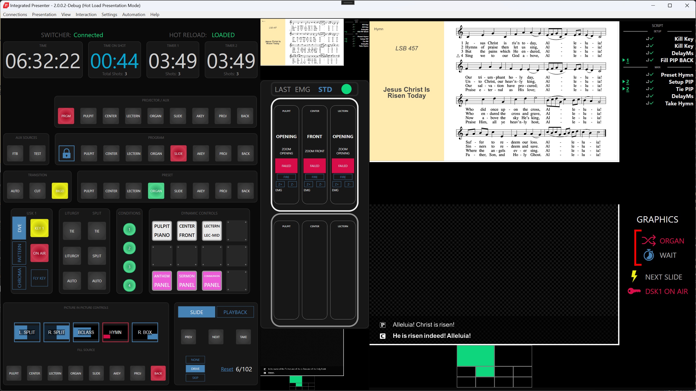
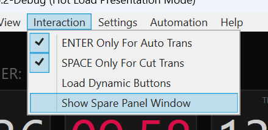
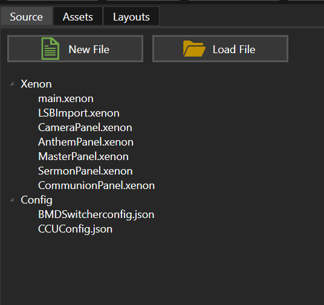
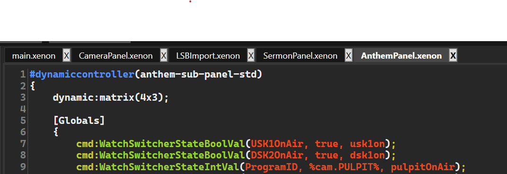
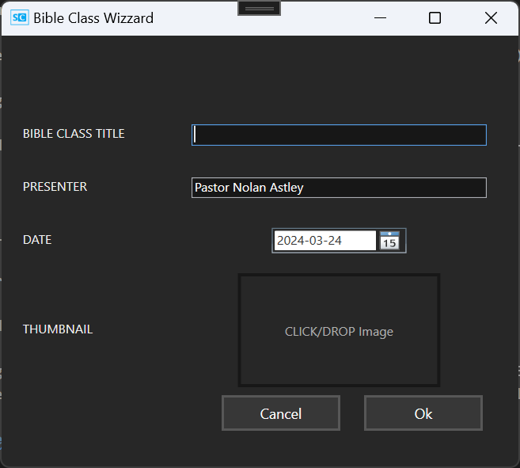

# Integrated Presenter 2.0

## UI Refresh

1. Repaint with consistent color scheme

2. All controls are now visible by default
   - Aux source bus + Advanced PIP controls
   - Removed ability to hide previews for (Previous/After) slides
   - Removed deprecated controls for 'slide pool' slides 

3. Camera Controls:
   1. Update status display
   2. Fix styling issues with longer preset names
   3. Remove unused 'Organ' cam driver
   4. Enabled 'Zoom-Bump' controls for active drivers (Z+ / Z- buttons) 
        - note: will run the smallest zoom increment (100ms)
        - TODO: calculate if it can be applied onto the zoom presets

4. Slide Previews:
    - script previews correctly differentiate between setup actions (fired prior to slide change) and main actions
    - script/automation previews moved to beside slide
    - more room for even longer scripts
    - Script action preview now shows either `[note]` or Command Name if no Note present

## Automation
- Corrected behaviour where postset wouldn't be re-fired when performing a (re)Take onto the current slide
- Script execution engine upgraded to support dynamic-runtime variables (SEE: LINK)
- Formalized inclusion of 'Spare Panel' in addition to 'Dynamic Controls'. For when MORE is MORE!
    - Accessible through the 'view' (or F11)
    

NOTE: Load Dynamic Buttons loads onto the main Dynamic Controls Panel
  - The spare panel is currently only accessible to be loaded via script command

Now allowing for a 7x12 control panel:

# Slide Creater 2.0

Full support for multi-file projects

1. New Tab for Source Files

NOTE: opening previous projects is still supported. Old style projects with all xenon code in one fill will automatically be upgraded to the new format, with all code included in the 'main.xenon' file.

2. Multi-tab editing

Prompted by the ever increasing length of projects, especially as we add panels, we now allow writing everything across multiple files, and editing in multiple tabs (though split-views aren't yet available).

Compiler messages have been adapted to indicate their originating source file where applicable.

All service builder imports place the majority of the code in LSBImport.xenon, with additional files added as necessary.

## Technical note on multi-file compilation

To preserver existing behaviour (in addition to developer sanity), files are compiled in order, and resulting slides are generated respectively.
That is to say: slides are generated in the order of commands written in a single file. Each file is complied in turn based upon the file's compilation order (ascending).

- `main.xenon` always has order 0
- all other files by default are ordered with ordering 1
- NOTE: files with equal orderings are not guaranteed to be compiled in the same sequence each render

The `#ORDER` command can be used to enforce compilation orderings.

NOTE: this directive MUST be the first line of the file to be recognized.

e.g.

`#ORDER -1` will force the file to be compiled ahead of `main.xenon`

`#ORDER 10` would give the file an ordering of 10

## Preprocessor Improvements

In addition to supporting the `#ORDER` directive, the preprocessor now supports conditional compilation

The 
`#DEFINE`
`#IF`
`#ELSE`
`#ENDIF`
directives provide this functionality.

This feature is used by default during LSBImport to assist with readings (SEE LINK)

NOTE: we don't support negation of definitions e.g. `#IF !someToken` (just use the `#ELSE` block)

NOTE: Nesting is supported, so complex expressions may require developers to brush-up on DeMorgan's theorems.

## Export Improvements

Thanks to @Carl for catching this one!

Exports into non-empty directories are not safe (ever since slides have been split across multiple output files)

Users will now be prompted in such cases.

Slide Creater's export engine has also been brought to parity with it's Renderer. Exports now pre-render the slides in parallel (just like it does for previews), and only the write to disk is sequential. This should help improve publish times.

## Additional Slide Creater Tools

Found under the 'Tools' Menu item:

### Bible Class Wizard

Just fill out the info, and the wizard will pull the latest template from here: https://github.com/kjgriffin/LivestreamServiceSuite/tree/bible-class-blob-data/blob-data (now source controlled)

Bible class is by default created in separate files, with a default ORDER of -1, such that it's safe and easy to contain both the Service proper, and Bible Class into one project/presentation

NOTE: The required thumbnail asset will be auto-imported into the project automatically

NOTE: The default date will be the next closest Sunday

### Generate Arbitrary Reading

This tool exposes both internal bible translations (NIV and ESV), and will generate formatted content ready for insertion into the `ctext` portion of a `#complextext` command.

This can be useful for constructing extra slides if there will be readings during the sermon, or for fixing issues during import where the reading was missed (SEE LINK)

## LSB IMPORT Improvements

- Agnus Dei is now detected as part of 'Distribution Hymns' and should fill PIP with the ORGAN camera instead of BACK by default
- Remaining Distribution hymns should still be correctly detected, even in the presence of Agnus Dei

- Auto-Title detection logic has been improved to still generate our 'scripted CopyTitle' style of slides for the title pages, even when missing information about Service Title/Service Date (warning messages will be generated where missing fields have been guessed)
    - This should fix issues where services fail to render in some cases when they imported using the (deprecated) `#viewservices` `#viewseries` and `#copyright` commands

### Import readings with all translations:

To address various issues where readings references were incorrectly parsed from service-builder when importing with the UseNIVReadingOverride flag, import behaviour has been modified to make use of conditional compilation.

LSB Import logic for readings generates the follow:

1. Always imports the text (ESV version) that's in Service Builder
2. Always attempts to import a local text translation (defaults to NIV) corresponding to each reading
3. Includes the following direction at the top of the LSBImport.xenon file `#DEFINE PEW-BIBLES` if importing using either ESV/NIV override flag.

Simply supplying/removing the `PEW-BIBLES` directive provides and easy way to swap between translations used during rendering, without requiring a re-import of the service.

NOTE: the reference parser has been beefed-up to support even more references, but since I've yet to find an exhaustive specification for how Lutheran Service Builder comes up with these, we're forced to do a best effort approach.
This is where the Arbitrary Reading Tool can come in handy, as usually manual inspection can give a hint as to how the reference needs to be fixed to work.

e.g. `1 Corinthians 5:6b–8` is incomprehensible, since the local NIV translation doesn't contain a `1 Corinthians 5:5b` verse, but instead only has a `1 Corinthians 5:6`. Removing the 'b' in this case solves the issue.

### 'UpNext'

The old `#upnext` command has been unified with modern features, and LSBImport now generates an equivalent set of slides using a `#scripted` block applied onto a `#html` slide. This allows for easier graphical styling, and means both numbered and unnumbered hymns now use the same format.

e.g.

    #scope(upnext-hymn)
    {
        #var("html.Layout", "Xenon.HymnTitles::UpNext")
        #scripted
        {
            first=#script
            {
                #Organ Intro;
                @cmd:WatchStateIntVal(ProgramID, %cam.SLIDESHOW%, upnext);
                @<upnext>cmd:PresetSelect(%cam.ORGAN%)[Preset Organ];
                @<upnext>cmd:DSK1TieOff;
                @<upnext>cmd:DelayMs(100);
                @<upnext>cmd:AutoTrans(100);
                @<upnext>cmd:DelayMs(1500);
                cmd:DSK1FadeOn[Key Fade On];
            }
    
            duplast=#script
            {
                #Organ Intro;
                @cmd:DSK1FadeOn[Key Fade On];
                @arg1:PresetSelect(%cam.ORGAN%)[Preset Organ];
                @arg1:DelayMs(100);
                @arg0:AutoTrans[Take Organ];
            }
    
            #html
            {
                text[annotation]{Come, You Faithful, Raise the Strain}
                text[hymn]{LSB 487}
                /* Leaving this empty as below, is sufficient for un-numbered hymns
                text[hymn]{}
                */
            }
        }
    }

While more verbose, replaces the old:

    #upnext("Next Hymn", "O Sing of Christ", "LSB 362")
    {
        #Organ Intro;
        !displaysrc='#_Liturgy.png';
        !keysrc='Key_#.png';
        @arg1:PresetSelect(%cam.ORGAN%)[Preset Organ];
        @arg1:DelayMs(100);
        @arg0:AutoTrans[Take Organ];
    }

Or it's unnumbered variant

    #scope(hymnintro)
    {
        #var("upnext.Layout", "Xenon.CommonColored::NoNumber")
    
        #upnext("Next Hymn", "Old Testament Canticle", "")
        {
            #Organ Intro;
            !displaysrc='#_Liturgy.png';
            !keysrc='Key_#.png';
            @arg1:PresetSelect(%cam.ORGAN%)[Preset Organ];
            @arg1:DelayMs(100);
            @arg0:AutoTrans[Take Organ];
        }
    
    }

NOTE: Both are still very much supported

This fix simply allows easier control of behaviour (which can be useful to 'speed' things up if required. I sometimes find during various Communion liturgies (Sanctus etc.) have 2 slides is burdensome)

