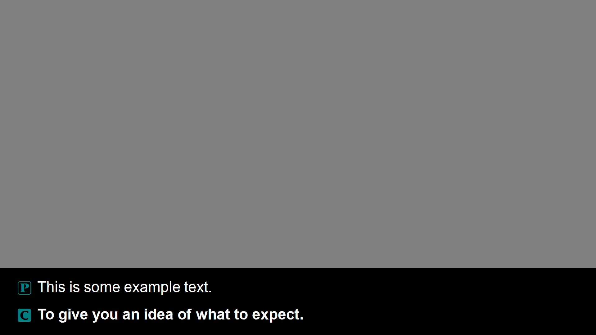
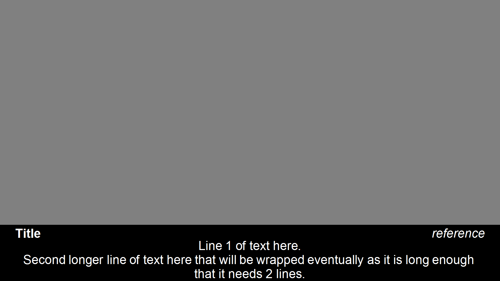
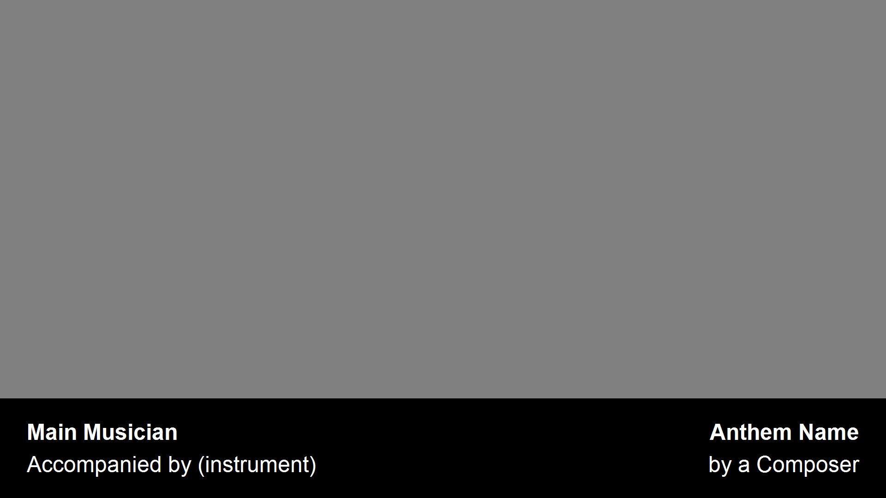
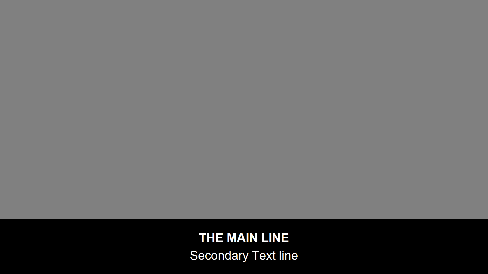
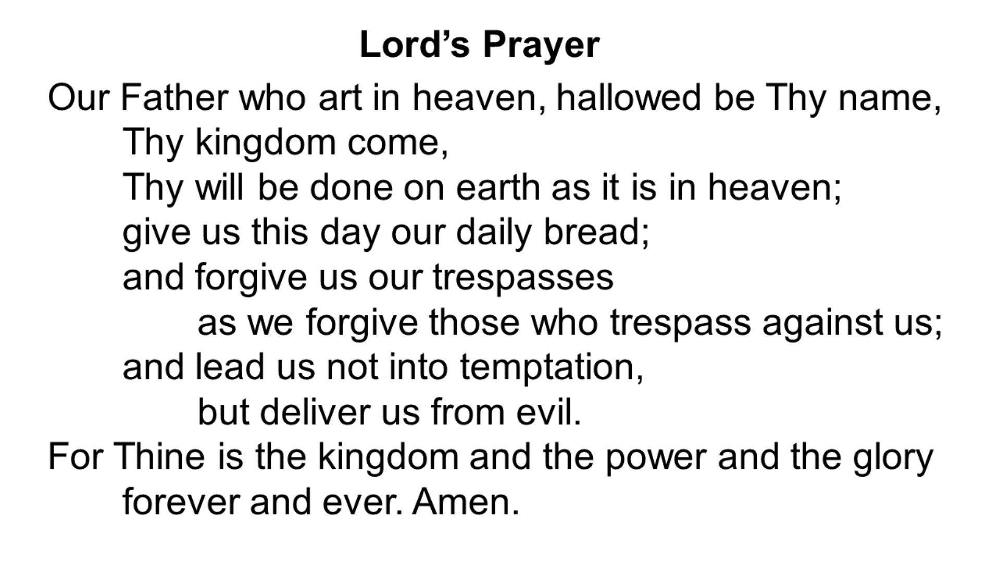
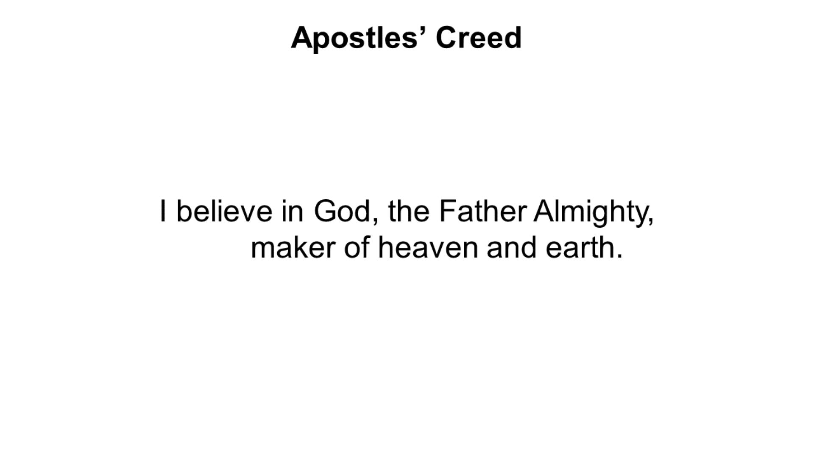
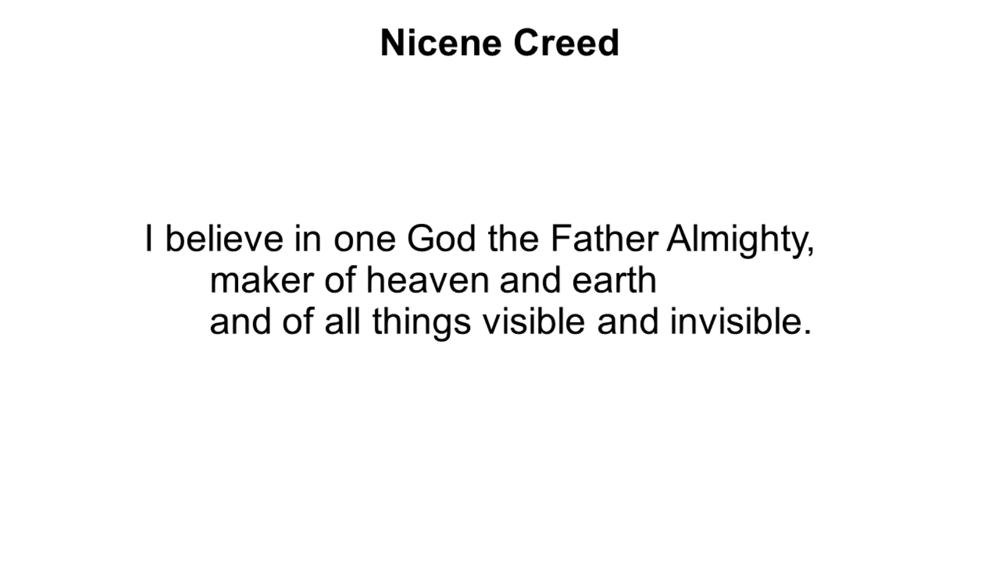
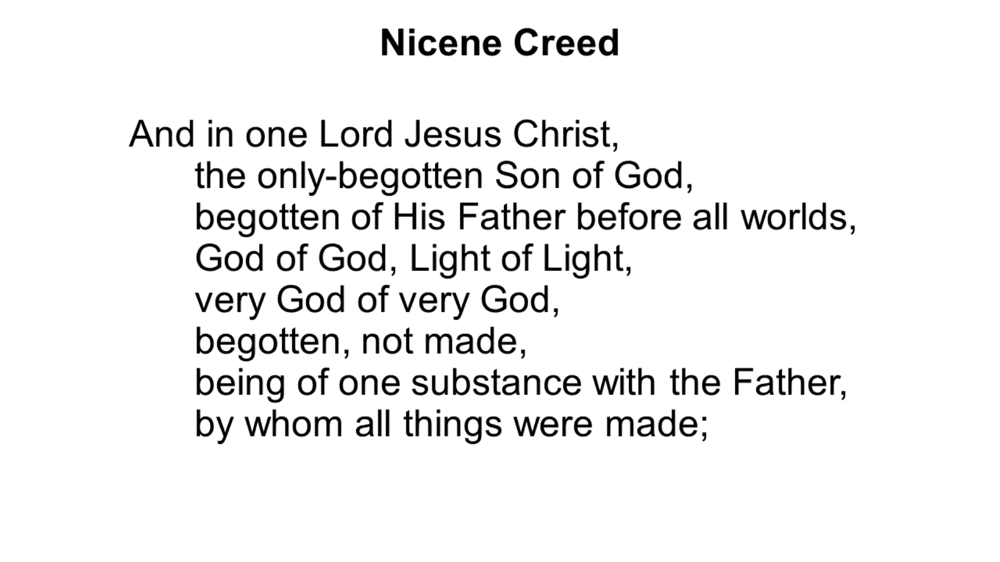
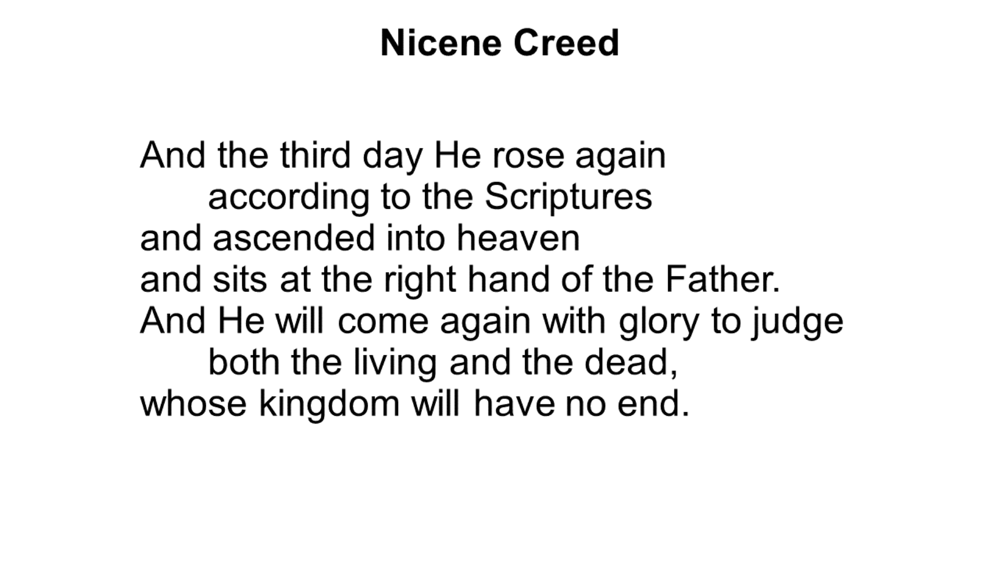
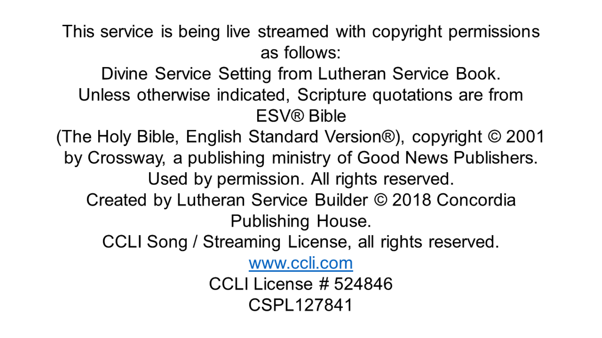

# Slide Creator Command Reference

Below are the following recognized commands:

- [set](#set)

- [liturgy](#liturgy)
- [break](#break)

- [tlverse](#titled-liturgy-verse)

- [video](#video)
- [fullimage](#full-image)
- [fitimage](#fit-image)
- [autofitimage](#auto-fit-image)
- [litimage](#liturgy-image)

- [reading](#reading)
- [sermon](#sermon)
- [anthemtitle](#anthem-title)
- [2title](#two-line-title)

- [texthymn](#text-hymn)
- [verse](#verse)

- [apostlescreed](#apostles-creed)
- [nicenecreed,](#nicene-creed)
- [lordsprayer](#lords-prayer)
- [copyright](#copyright)
- [viewservices](#view-services)
- [viewseries](#view-series)

# Set

Sets a project-wide variable.

## Use:

    #set("<somevariable>", "<somevalue>")

## Params:

### somevariable \<string>
- name of the project variable

### somevalue \<string>
- value to set the variable to

Current variables used by project:

## Variable: 'otherspeakers'
Use: 'speakeridentifier-speakertext'

    #set("otherspeakers", "Pastor:-P")

## Variable: 'litspeakertextcol'
Use: 'red,green,blue'

    #set("litspeakertextcol", "255, 0, 0")

## Variable: 'littextcol"
Use: 'red,green,blue'

    #set("littextcol", "255, 0, 0")

## Variable: 'litbackgroundcol'
Use: 'red,green,blue'

    #set("litbackgroundcol", "255, 0, 0")

# Liturgy

Used to apply liturgy layout rules to text.

## Use:

    #liturgy[(<speakerstartonline>)] {

    }

## Params:

### speakerstartonline \<bool> (default=false)
- True: Only detects speakers at the start of a line

Will search source text for *speakers* and then assign lines to them.

## Speakers
The default speakers are:

- P - Pastor
- C - Congregation
- A - Assistant
- L - Leader
- R - Responder
- $ - None

Setting the project variable '[otherspeakers](#variable:-'otherspeakers')' will add user defined speakers d

Accepts an optional parameter to determine if it should only recognize speakers if they start a line (default = false)

    // Default use
    #liturgy {
    P Some example text.
    C This is cool.
    }
    
    // With Parameter
    #liturgy(true) {
    P this should P only detect one speaker.
    }

In the Liturgy source text the character sequence ' T ' will be rendered as a special LSBSymbol character 'T'

## Render Behaviour
All the text within the {} of the #liturgy command will be split onto slides that look like:

    #liturgy {
    P This is some example text.
    C To give you and idea of what to expect.
    }

# Break

## Use:
    liturgy...
    #break
    liturgy...

The break command is valid within the #liturgy source text. It will force a slide break.

    #liturgy {
    P Some content that fits on one slide.
    #break
    C This will be forced onto a second slide.
    }

# Titled Liturgy Verse

Renders Liturgy As Centred Text with a title and refence.

## Use:

    #tlverse("<title>", "<reference>") {
        ...content...
    }

## Params:

### title \<string>
- Slide Title
### reference \<string>
- Slide Reference

## Render Behaviour

Speakers are detected, but not rendered. The renderer will attempt to fit all the text onto the slide, cramming it in if needed.

Example:

    #tlverse("Title", "reference") {
    $ Line 1 of text here.
    $ Second longer line of text here that will be wrapped eventually as it is long enough that it needs 2 lines.
    }

# Video

## Use: 
    #video(<assetname>)

## Params:

### assetname \<string>
- Refers to an asset name from the project assets.

This command is automatically used when a video asset is inserted as 'Insert'

## Render Behaviour

The video will be inserted as a slide.

# Full Image

## Use:

    #fullimage(<assetname>)

## Params:

### assetname \<string>
- Refers to an asset name from the project assets.

## Render Behaviour

Renders the image unscaled.

# Fit Image

## Use:

    #fitimage(<assetname>)

### assetname \<string>
- Refers to an asset name from the project assets.

This command is automatically used when a image asset is inserted as 'Insert'

## Render Behaviour

Renders the image with uniform scaling up/down so that the limiting dimension is not clipped.

# Auto Fit Image

## Use:
    #autofitimage(<assetname>)

### assetname \<string>
- Refers to an asset name from the project assets.

This command is automatically used when an asset is inserted as 'Hymn'

## Render Behaviour

Renders the image with uniform scaling up/down so that the limiting dimension is not clipped. Auto detects the 'true' size of the image by inspecting every pixel in the image to find the outer pixel for each direction (top, bottom, left, right) that is not white.
Fills only 93% of slide to pad the image with a white border

# Liturgy Image

## Use:
    #litiamge(<assetname>)

### assetname \<string>
- Refers to an asset name from the project assets.

This command is automatically used when an asset is inserted as 'Liturgy'

## Render Behaviour

Renders the image with uniform scaling up/down so that the limiting dimension is not clipped, based on the 'true size' and then fills 93% available area. Will invert image colors so that black is rendered white and white is rendered black.

# Reading

## Use:

    #reading("<name>", "<reference>")

## Params:

### name \<string>
- name to call the reading. (eg. First Reading, Gospel)

### reference \<string>
- verse reading is from

## Render Behaviour

    #reading("First Reading", "Somewhere 3:5-18")

# Sermon

## Use:

    #sermon("<name>", "<reference>", "<preacher>")

## Params:

### name \<string>
- sermon title
### reference \<string>
- text sermon is based upon
### preacher \<string>
- name of the preacher

## Render Behaviour

*The sermon slide will also instruct Integrated Presenter to restart the general purpose timer 1.

    #sermon("'An Insightful Sermon'", "Based Upon Somewhere 2:4-14", "The Rev. Preacher")

# Anthem Title

## Use:

    #anthemtitle("<name>", "<musician>", "<accompanist>", "<credit>")

## Params:

### name \<string>
- name of the anthem
### musician \<string>
- the main performer(s)
### accompanist \<string>
- the accompanists
### credit
- credits/author of piece

## Render Behaviour

    #anthemtitle("Anthem Name", "Main Musician", "Accompanied by (instrument)" "by a Composer")

# Two Line Title

## Use:

    #2title("<majortext>", "<minortext>", "<orientation>")

## Params:

### majortext \<string>
- the main line of text
### minortext \<string>
- the secondary line of text
### orientation \<string> (default = 'horizontal')
- the layout direction of the lines
- Horizontal layout = both on middle line. Main line left justified (bold). Minor line right justified.
- Vertical layout = two lines. Main line top (centre justified, bold). Minor line bottom (centre justified)

## Render Behaviour

    #2title("THE MAIN LINE", "Secondary Text line", "vertical")

    #2title("THE MAIN LINE", "Secondary Text line", "horizontal")

# Text Hymn

## Use:

    #texthymn("<title>", "<hymnname>", "<tune>", "<number>", "<copyright>")
    {
        ...#verse{}...
    }

## Params:
### title \<string>
- Slide title
### hymnname \<string>
- Name of the Hymn
### tune \<string>
- Name of Tune (if different)
### number \<string>
- Hymn number and verses
### copyright \<string>
- Copyright info for hymn

Note: Requires at least one [verse](#verse) to render the hymn.
Each verse is rendered on a sperate slide.

# Render Behaviour

    #texthymn("Hymn Title", "Hymn Name", "Alt Tune Name", "Hymnal #111", "Copyright stuff that needs to be put there, but that no-one actually reads")
    {
    #verse {
    Line 1
    Line 2
    Line 3
    Line 4
    } 
    }

# Verse

Only valid in a [#texthymn](#text-hymn) command.
Defines the lyrics for a verse.

## Use:

    #verse {
        ...lines...
    }

## Render Behaviour
Each line will be rendered as one line. No attempt will be made to fit lines that are too large/small. Lines will be spaced equidistant vertically.

# Lords Prayer

Prefab slide.

## Use:

    #lordsprayer

## Render Behaviour
Inserts the prebuilt slide for the lords prayer.

# Apostles Creed
Prefab slide.
## Use:
    #apostlescreed
## Render Behaviour
Inserts the 3 prebuilt slide for the lords prayer.

# Nicene Creed
## Use:
    #nicenecreed
Prefab slide.
## Render Behaviour
Inserts the 5 prebuilt slide for the lords prayer.

# Copyright
## Use:
    #copyright
Prefab slide.
## Render Behaviour
Inserts the prebuilt slide for the lords prayer.

# View Services
## Use:
    #viewservices
Prefab slide.
## Render Behaviour
Inserts the prebuilt slide for the lords prayer.

# View Series
## Use:
    #viewseries
Prefab slide.
## Render Behaviour
Inserts the prebuilt slide for the lords prayer.
