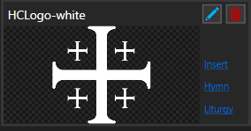

# Slide Creater

This is the Slide Creater User interface.

## UI Tour

The UI contains several main components:

### 1. Textbox

This is the primary location for interaction. Here you can write the description of all the slides you'd like to make for your *presentation*.

### 2. Slide Previews
On the right you'll see previews for all the slides that will be generated as part of the project.
There is a large preview of the selected slide, and a list of every slide.
The list of slides will display both the rendered Display and Key for the slide. It will also provide additional information such as how the resulting files will be named, and if any *postset* will be attached.

There's an option to have the selected preview the Key instead of the Display. 
`Menu>View>Preview Keys`

## 3. Assets Tab
The assets tab provides previews and tools to manage the project's assets.
By default all new projects will include the HCLogo-white asset. The LSB Import will automatically add any assets used in the LSB service. You can manually add assets with `Add Asset`. `Remove All` will remove every asset from the project.

Each Asset will be previewed like this:

- Using the red trashcan, you can delete the asset from the project.

- The Blue pencil will let you rename the asset. This will change how the asset must be referenced in the source code.

- the 3 blue hyperlinks will automatically generate the appropriate command text and insert it into the source code at the cursor location
	- `Insert` will add it as a #fullimage
	- `Hymn` will add it as an #autofitimage
	- `Liturgy` will ad it as #litimage
	- `Bells` will add (only for audio) a script with the setup

## 4. Layouts Tab 

## Workflow Overview

The typical workflow for creating a service is:

1. From the main menu: `Menu>Import>Import` from LSB Service
2. Using the Assets tab: Add any additional assets (title pages, bells, videos etc.)
3. Make changes to the project's source code
4. `Render` and preview slides (repeat step 3 and 4 to make changes if required)
5. `Publish` the slides

## LSB Import

## Layouts

## SC Commands

## Presentations